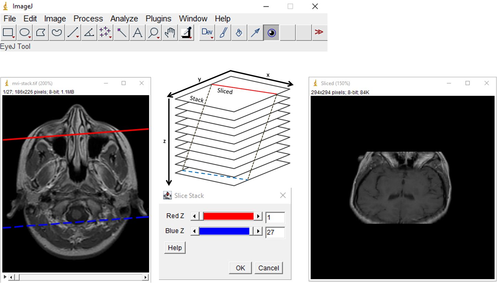

# Slice Stack - an ImageJ plugin to slice a stack

Plugin Slice Stack uses 2 parallel lines red and blue on 2 different slices of a stack or the same slice to get a sliced image, the top and bottom of the sliced image correspond to the red and blue lines on the stack. The plugin runs on 3D stacks of 8, 16, 32 bits and RGB color.

The red and blue lines can:

**Move up and down the stack in Z** by the 2 sliders red and blue in the Slice Stack window. The line shows as a solid line when it is on the current slice, otherwise the line shows as a dash line. By default the red line is on the top slice of the stack and the blue line is on the bottom slice.

**Rotate in the XY plane** using the mouse to drag the 4 ends of the 2 lines.

**Translate in the XY plane** using the mouse to drag between the 2 ends of the line.

Therefore the 2 lines have in total of 6 transformations in the XY plane. In case the mouse is pressed but not on any of the 2 lines, the previous transformation will continue. For example, if the red line was translated previously, the red line will continue translate to where the mouse is pressed. To switch among the 6 transformations, simply click on the line at the end or between its 2 ends. Select the Slice Tool installed in the ImageJ Toolbar by the plugin to do the 6 transformations of the 2 lines.  

The plugin assumes the stack has equal pixel width and pixel height, and larger voxel depth as in usual microscopy images. A pixel in the sliced image is bilinear interpolated from the slice of the stack if both the red and blue lines are on the slice. If a pixel in the sliced image is between 2 slices, it is linear interpolated between the 2 bilinear interpolated points in the 2 slices.
